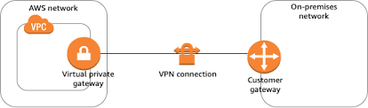

# terraform-aws-transit-gateway

This module creates the transit gateway network resources.

The following resources will be created:
 - Private Gateway
 - Customer Gateway 
 - VPN Site-to-site connection


## Execution Diagram of `terraform-aws-vpn-connection`


## Usage

```hcl
module "vpn" {
  source = "git::https://github.com/DNXLabs/terraform-aws-vpn-connection?ref=1.0.0"
  vpc_id                                    = module.network[0].vpc_id
  vpn_gateway_amazon_side_asn               = 64512
  customer_gateway_bgp_asn                  = 65000
  customer_gateway_ip_address               = "172.0.0.1"
  route_table_ids                           = []
  vpn_connection_static_routes_only         = true
  vpn_connection_static_routes_destinations = ["10.80.1.0/24"]
  vpn_connection_tunnel1_inside_cidr        = null
  vpn_connection_tunnel2_inside_cidr        = null
  vpn_connection_tunnel1_preshared_key      = null
  vpn_connection_tunnel2_preshared_key      = null
}
```

<!--- BEGIN_TF_DOCS --->

## Requirements

| Name | Version |
|------|---------|
| terraform | >= 0.13.0 |
| aws | >= 3.56.0 |
| random | >= 2.1.0 |
| tls | >= 3.1.0 |

## Providers

| Name | Version |
|------|---------|
| aws | >= 3.56.0 |

## Inputs

| Name | Description | Type | Default | Required |
|------|-------------|------|---------|:--------:|


## Outputs

No output.

<!--- END_TF_DOCS --->

## Authors

Module managed by [DNX Solutions](https://github.com/DNXLabs).

## License

Apache 2 Licensed. See [LICENSE](https://github.com/DNXLabs/terraform-aws-vpn-connection/blob/master/LICENSE) for full details.
